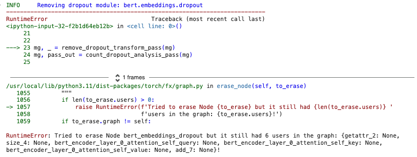

# ADL Coursework

## Lab 0:

### Tutorial 1

Using Mase and Torch FX to generate compute graohs for PyTorch models. This is done by symbolically tracing a model by replacing Tensor objects with Proxy objects. Every operation on these Proxy objects is recorded to construct a compute graph. 

**Understanding FX Node Types**

*   `placeholder`: Model inputs.
*   `get_attr`: Retrieves parameters (e.g., weights/biases).
*   `call_function`: Calls standalone functions (e.g., `torch.relu`).
*   `call_module`: Calls an `nn.Module`'s `forward()` method.
*   `call_method`: Calls a method on a Tensor (e.g., `.relu()`).
*   `output`: Represents the function's return value.

#### **What is an Analysis Pass?**

An **analysis pass** extracts information from the compute graph and annotates it with metadata. This metadata is later used for **model parallelism (splitting across GPUs)** or **hardware acceleration (generating Verilog for FPGAs).**

##### **Key Analysis Passes**

1.  **init\_metadata\_analysis\_pass** → Creates an empty metadata dictionary (`node.meta["mase"]`) for each node.
2.  **add\_common\_metadata\_analysis\_pass** → Adds **operator type** (e.g., `relu`, `matmul`) and **shape information** (e.g., tensor dimensions, dtype).

#### **4\. Running an Analysis Pass**

We use a **dummy input** (e.g., tokenised text for a BERT model) to simulate a forward pass and collect metadata.

### **Explanation of the Dropout Analysis and Removal Pass**

#### **Step 1: Counting Dropout Layers**

*   The analysis pass iterates over **all nodes** in the compute graph.
*   If a node represents a **dropout module** (`call_module` with "dropout" in its name), it is counted.
*   The `get_logger` API logs information about detected dropout layers.

#### **Step 2: Removing Dropout Nodes**

*   Since **dropout is only used during training**, it can be removed from the inference graph.
*   The transform pass **deletes all dropout nodes**.
*   Before deleting a dropout node, we **replace all its uses with its input**, so other nodes can still function.

> Task: Delete the call to 'replace\_all\_uses\_with' to verify that FX will report a RuntimeError

**Why use** `**replace_all_uses_with(node.args[0])**`**?**

*   **Ensures all nodes that depended on dropout still function**.
*   If not used, those nodes will try to access a now-deleted dropout node.

If you **remove** `replace_all_uses_with(node.args[0])`, the dropout node is deleted **without redirecting its outputs**. This leaves dangling references in the graph.



Saved MaseGraph:

.svg)

### Tutorial 2:

**BERT MODEL:** Deep learning model developed by Google designed for natural language processing (NLP) tasks.

> **Task 2:** Remove the \`attention\_mask\` and \`labels\` arguments from the \`hf\_input\_names\` list and re-run the following cell. Use \`mg.draw()\` to visualize the graph in each case. Can you see any changes in the graph topology? Can you explain why this happens?

 `attention_mask` is used to ignore padding tokens during attention compitations. without it, all tokens (including padding) are considered equal, leading to incorrect attention weighting and worse performance. Basically, it is used to indicate whcih toeksn are padding (0) and whihc are actual words (1). Removing it, the model will treat all tokens equally, including the padding tokens, which can intoduce noise in the computations. 

*   **Padding**: extra tokens (usually zeros) used to make all sequences the same length. Without `attention_mask` the model treats padding like real words, which confuses learning and adds noise.

`labels` is used in training to compute the EntropyLoss at the final layer. When removing it, the loss is omitted meaning the graph will now only output logits, not loss 

Difference in the graph: The difference in the grapoh is that now the nodes related to masking perations have dissapeared, as well as the loss computation node is removed. the final graoh becomes simpler, showing only forward comptations without loss.

Parameter Efficient Finetuning (PEFT) with LoRA.

LoRA involves replacing W with A and B which are low-rank matrices. We freeze W parameters and only allow the optimizer to train the parameters in A and B. This enables to acheive accuracies comparable to full fine tuning, while only training a fraction of the parameters. 

Total Trainable Parameters: 14480258 without LoRA

Total Trainable Parameters: 3169816 with LoRA

Once lora is conduncted, we can pass `fuse_lora_weights_transform_pass` to optimize the model for inference, replacing each LoRA instance with `nn.Linear` module, where the AB product added to the original weight matrix. 

By adjusting the rank number of LoRA, we can control the trade-off between memory usage and fine-tuned accuracy. Such parameter-efficient fine-tuning techniques are very useful in the area of large language models (LLMs), where the memory requirement for training is a significant bottleneck.

## Lab 1: Model Compression (Quantization and Pruning)

### Tutorial 3

Use BERT model fine tuned for sequence classification and run Mase quantization pass. 

*   Post-Training Quantisation (**PTQ**): Once the model is trained, quantise the model and evaluate accuracy
*   Run further training iterations of the quantized model (**QAT**): Once quantized, train more to see difference in accuracy.

In this tutorial, use the model from Tutorial 2 trained with LoRA. 

Accuracy of `tutorial_2_lora` is 83.8%.

**PTQ:**

Running the qunatization pass: defines the quantization mode, numerical fomat and procession for each operator in the graph. 

Immediate effect of quantization of the model accuracy: 82.3%

**QAT:**

Train the model once you have run the quantization pass. 

Accuracy after 1 training epoch post quantization: 84.2%

Quantized model accuracy exceeds the full precision model, with much lower memory requirement to store the weights.

1.  In Tutorial 3, you quantized every Linear layer in the model to the provided configuration. Now, explore a range of fixed point widths from 4 to 32.
    1.  Plot a figure where the x-axis is the fixed point width and the y-axis is the highest achieved accuracy on the IMDb dataset, following the procedure in Tutorial 3.
    2.  Plot separate curves for PTQ and QAT at each precision to show the effect of post-quantization finetuning


As shown, fixed point widths were controlled to be 4, 8, 12, 16, 20, 24, 28, 32 bits. The training after quantisation was set to 1 as this task only asks to investigate the precision needed, and does not require to see the amount of training required. 

In order to see if this assumption was correct, an additional test was also conducted to see if epoch number had a large effect on accuracy of the basic model without quantization. It was found that an epoch number of 5 was best, achieving the highest accuracy wihtout overfitting the data which was found once more epochs were used. This is shown in the figure below: 


### Tutorial 4

Pruning: used to reduce size and complexity of neural networks by removing unnecessay parameters. Used to reduce model size, decease inference time, impove generalisation and being more energy efficieny. 

*   Structued pruning: removes entire structures (channels, filters, layers)
*   Unstructured pruning: removes individual weights or connections.

Unstructured pruning:

*   Sparcity: value from 0 to 1, express portion of element in the model that should be pruned 
*   Method: pruning methods, including random and L1-norm 
*   Scope: defines whether to consider each weight/activation individually (local) or all tensors in the model (global)

1.  Take your best obtained model from Task 1 and rerun the pruning procedure, this time varying the sparsity from 0.1 to 0.9.
    1.  Plot a figure where the x-axis is the sparsity and the y-axis is the highest achieved accuracy on the IMDb dataset, following the procedure in Tutorial 4.
    2.  Plot separate curves for `Random` and `L1-Norm` methods to evaluate the effect of different pruning strategies.


**As shown, L1-Norm pruning showed the best accuracy after pruning. with a drastic decrease in accuracy as the pruning sparsity fell below 0.6. WHY IS L1NORM BETTER? WHY IS RANDOM WORSE AFTER SO MUCH LESS PRUNING SPARCITY .**

## Lab 2: Neural Architecture Search

### Tutorial 5

Neural Architecture Search (NAS) with Mase and Optuna. 

`trial.suggest_int` and `trial.suggest_category` to trigger the chosen sampler to choose parameter choices and layer types. Basically foes thrugh the suggested parameters and tries different combinations. 

The objective function is used to create a new model instance with the chosen parameters according to a sampler, which is trained on the IMDb dataset for a number of epochs. 

If the layer has **equal input and output features**, it **randomly selects** (via `trial.suggest_categorical`) whether to **keep it as** `**nn.Linear**` or **replace it with** `**Identity**`.

*   **It depends on the** `**trial**` **execution.** Each layer with `in_features == out_features` is individually **decided at random** to be either:
    *   `**nn.Linear**` **(default case, keeps it as is).**
    *   `**Identity()**` **(replaces the linear transformation with an identity operation).** This simply passes the input forward unchanged, removes the learnable transformation at the later.

### Task 1

1.  Tutorial 5 shows how to use random search to find the optimal configuration of hyperparameters and layer choices for the Bert model.
    1.  Now, explore using the GridSampler and TPESampler in Optuna.
    2.  Plot a figure that has the number of trials on the x axis, and the maximum achieved accuracy up to that point on the y axis. Plot one curve for each sampler to compare their performance.


Optuna's Sampler chooses between nn.Linear or Identity for each layer using TPE, Gridsampler or Random. 

Sampling between nn.Linear or Identity is useful to reduce model complexity, simulate sparse architectures, parameter search for optimal depth, and reducing overfitting.

Overall, TPE was the sampler with the best achieving accuracy, as it builds a probabilistic model for promising parameter regions and actively searches for better parameters based on past evaluations. Unlike Gridsampler, which explores a fixed set of paramters blindly and RandomSampler whcih selects parameters randomly, TPE focuses more on areas that are expected to yield higher accuracy.

Once the best model with TPESampler was found, more training epochs were given to the model to see if accuracy can be increased further. As shown in the graph below, it was found that the accuracy decreased, highly due to overfitting when epochs were further increased.


Additionally, to see the changes between each epoch, the following plot was made, showing clear overfitting even after the first iteration.


To further investigate if overfitting was occuring with more epochs, a plot of the loss function at each step of training was competed. Even after 50% of 1 epoch, the loss started increasing again, demonstrating that the accuracy values would decrease in values, proving overfitting occured.


### Task 2

Once the model is constructed and trained for some iterations, call the CompressionPipeline to qunatize and pune the model, the continue training for a few more epochs. Use the sampler tat yeods best results in Task 1 to run the compression aware seach. The obectve function should retun gthe final accuracy fo the mdoe after compression. consider also th case wehre final training si performed after qunatixation. 

Get the best model from task 1, see how training affects it. 

Compression-aware search without post-compression training and compression aware with post compression training. 

1.  In Tutorial 5, NAS is used to find an optimal configuration of hyperparameters, then we use the CompressionPipeline in Mase to quantize and prune the model after search is finished. However, the final compressed model may not be optimal, since different model architectures may have different sensitivities to quantization and pruning. Ideally, we want to run a compression-aware search flow, where the quantization and pruning is considered in each trial.
    1.  In the objective function, after the model is constructed and trained for some iterations, call the CompressionPipeline to quantize and prune the model, then continue training for a few more epochs. Use the sampler that yielded the best results in Task 1 to run the compression-aware search. The objective function should return the final accuracy of the model after compression. Consider also the case where final training is performed after quantization/pruning.
    2.  Plot a new figure that has the number of trials on the x axis, and the maximum achieved accuracy up to that point on the y axis. There should be three curves: 1. the best performance from Task 1 (without compression), compression-aware search without post-compression training, and compression-aware search with post-compression training.


Before this test was completed, no more training epochs were added to the data, this is because it was found previously that with more training, the model overfit, decreasing accuracy. It was shown that post quantisation training lead to higher accuracy than the baseline, which may be due to reduced complexity reducing overfitting.

## Lab 3: Mixed Precision Search

Defining a search space with linear\_layer\_choices as well as `width_choices` and `fractional_width_choices`. 

This tutorial is very similar to tutorial 5. 

1.  In Tutorial 6, all layers allocated to IntegerLinear are allocated the same width and fractional width. This is suboptimal, as different layers may have different sensitivities to quantization.
    1.  Modify the code to allow different layers to have widths in the range \[8, 16, 32\] and fractional widths in the range \[2, 4, 8\]. Expose this choice as an additional hyperparameter for the Optuna sampler.
    2.  Run the search again, and plot a figure that has the number of trials on the x axis, and the maximum achieved accuracy up to that point on the y axis.


As shown, using TPE search, the accuracy increased significantly after the 2nd trial. Due to no further increase after 10 trials, the test was stopped.

1.  In Section 1 of Tutorial 6, when defining the search space, a number of layers are imported, however only LinearInteger and the full precision nn.Linear are selected.
    1.  Now, extend the search to consider all supported precisions for the Linear layer in Mase, including Minifloat, BlockFP, BlockLog, Binary, etc. This may also require changing the model constructor so the required arguments are passed when instantiating each layer.
    2.  Run the search again, and plot a figure that has the number of trials on the x axis, and the maximum achieved accuracy up to that point on the y axis. Plot one curve for each precision to compare their performance.


ADD A PLOT WITH THE DIFFERENT PRECISIONS USED, epoch 0.1 since overfitting, doesnt make accuracy go up. 

the plot needs to have both combined graph with all the different ones, then a zoom in with the ones which we dont think are correct

Then also complete a search with all of them at the same time and see which layers will take which component, but needs a lot of trials

## Lab 4: (Software Stream) Performance Engineering

torch.compile: Makes Pytorch models run faster. In-time compiler that optimizes the model and the input data for the specific hardware.

*   JIT compilation – converts python code into machine code at runtime. Continuously analyses the code being executed and identifies parts of the code where the speedup gained from compilation or recompilation would outweight the overhead of compiling that code.

### 1\. In the first part of Lab 4 (torch.compile), we did not really observe real run-time speedups with torch.compile.

1.  Modify the code and investigate why this is the case?

```python
# Run multiple times and compare
for i in range(3):
    print(f"Run {i+1}")
    avg_t = time_model(model, n=n, device=device)
    opt_avg_t = time_model(opt_model, n=n, device=device)
    print(f"Original model: {avg_t:.4f} s")
    print(f"Optimized model: {opt_avg_t:.4f} s")
```

```
Run 1
Original model: 9.0700 s
Optimized model: 6.1027 s

Run 2
Original model: 9.2037 s
Optimized model: 5.8397 s

Run 3
Original model: 9.0928 s
Optimized model: 5.5648 s
```

First-Time Compilation Overhead

*   torch.compile JIT-compiles the model during the first execution.
*   This introduces an overhead, causing the first run to be significantly slower.
*   The speedup is usually seen in subsequent runs. S- olution: Try running the benchmark multiple times and discard the first run.

### 2\. If you change the device to cuda, do you observe the same thing?

```python
# Function to move data to the same device
def get_data(batch_size=1, input_size=(3, 224, 224)):
    """Generate a dummy input tensor and move it to the target device."""
    return torch.randn(batch_size, *input_size).to(device)

# Define function to time model execution
def time_model(model, n=10, device="cuda"):
    """Measure the average inference time of the model."""
    model = model.to(device)
    data = get_data()
    
    # Warm-up to ensure accurate timing
    with torch.no_grad():
        for _ in range(3):
            model(data)

    # Measure execution time
    start = time.time()
    with torch.no_grad():
        for _ in range(n):
            model(data)
    end = time.time()
    
    return (end - start) / n
```

```
Original model (GPU): 0.0057 s 
Optimized model (GPU): 0.0019 s
```

Explicitly Move the Model and Data to GPU Make sure:

*   Your model is moved to the GPU using .to(device).
*   Your input tensors are also moved to the GPU.

### 2\. In the second part of Lab 4 (kernel fusion), we looked at a fused SDPA kernel.

Kernel Fusion: Can reduce both the number of memory accesses and number of kernels launches. 

Improve computational efficiency by reducing memory accesses and kernel launches. In Pytorch, matrix multiplication and activation function (e.g. ReLU) are executed as separate GPU kernels. 

                  Loads data from global memory (slow)

                  Computes the operation

                  Writes results back to global memory. 

Example of slow implementation: 

Problem: This approach launches three separate GPU kernels:

1.  Matrix Multiplication (QKᵀ)
2.  Softmax
3.  Matrix Multiplication (Attn @ V)

Kernel Fusion fuses both kernel in 1, matrix multiplication and ReLU activation are executed within the same kernel. The ReLU transformation is applied directly after multiplication, before writing to global memory. 

`F.scaled_dot_product_attention()` is used to fuse all the three steps in the example into one GPU kernel. Uses **FlashAttention optimizations**. 

1.  Loads small tiles of Q, K, V into GPU shared memory
2.  Computes attention scores and softmax within registers (fast local memory)
3.  Uses trick called “online softmax”  
    1.  Rather than computing softmax at once, stores only the row max & row sum to accumulate results more efficiently. 
4.  Computes weighted sum of V efficiencly without writing intermediate results to global memory. 

### Now, extend the profiling to the SDPA kernel, compare its runtime behavior with the naive implementation.

```
Running on: cpu 
Naïve SDPA Time: 0.023348 s 
Fused SDPA Time: 0.020229 s 
Speedup Factor: 1.15x (Higher is better)
```

### If you change the device to cuda, do you observe the same thing?

```
Running on: cuda
Naïve SDPA Time: 0.000502 s
Fused SDPA Time: 0.000274 s
Speedup Factor: 1.83x (Higher is better)
```


In the third part of lab4 (Custom kernel), we go through how to write MXINT8 dequantization kernel and bind it to Python.

1.  How does MXINT8 benefit custom hardware if both the activation and weights in a linear layer are quantized to MXINT8?
2.  What is the purpose of the variable dont\_need\_abs and bias in the C++ for loop?
3.  How does cta\_tiler partition data for copying to shared memory in CUDA kernel? How does layout\_sX partition threads in a threadlock for computation? (Challenge)
4.  Why the saved GPU memory is not exactly (32 - (4+8/32))/32 = 86.7% of the FP32 model?